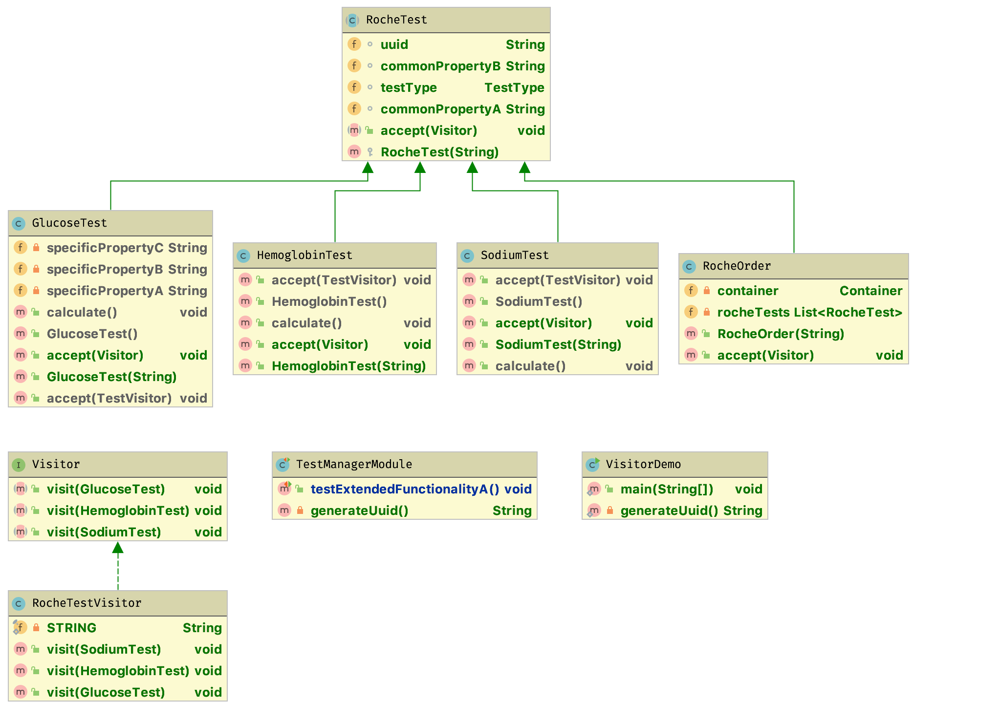

# Solution proposal

## High level refactoring strategy

In order to avoid touching the core to extend the core functionality, a `Visitor` interface should be implemented and it associated method.
Thus, any class implementing the before-mentioned interface to add functionality and maintain a loose coupling between them. 
Later on, any new functionality to the core can be extended by creating new classes implementing the visitor pattern. A whole set of behaviors could be added by creating a single class, making it easy to maintain.

### Proposed project structure

An ordinary java app structure is used.
* Model/domain classes are located at `model` package
* A `service` package contains an interface and its possible implementations.
* A `legacy` package contains legacy code to be extended, but not touched.

### Design patterns used

* **Visitor pattern:** the visitor pattern is a behavioral design pattern by the Gang of Four with the intention of extending the current functionality without (barely) touching the code.
* **Builder pattern:** the builder pattern is a creational design pattern supporting the selective creation of complex objects in a simple way.
* **Singleton pattern:** one of the most famous design patterns, is used to maintain a single object throughout the app.

### UML Diagram

 